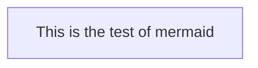

# java.util.Map<br>
https://docs.oracle.com/javase/tutorial/collections/interfaces/map.html
<br>

> É uma interface que NÃO estende java.util.Collection.<br>

> Implementações:
> - java.util.HashMap
> - java.util.TreeMap
> - java.util.HashTable
>
> Diferença entre Map e Collection é que Map armazena dois tipos de objetos,
> sendo o primeiro uma chave (deve ser única e permite indexação) e o segundo 
> sendo um valor de atribuição para a chave.
>
> Utilizado para comparações de valores.
> Permite valores repetidos, mas as chaves devem ser únicas.

> Operações permitidas:
> - adição,
> - busca por chave ou valor,
> - atualização,
> - remoção
> - navegação.

<br>



<p>====================================></p>

### _*Exercize*_ 

<br>
<p>Crie um Map e execute as seguintes operações:

- Adicione os 26 Estados brasileiros no Map, onde a sigla será
  a chave e o nome do Estado o valor;
- Remova o Estado de Minas Gerais;
- Adicione o Distrito Federal;
- Verifique o tamanho do Map;
- Remova o Estado de Mato Grosso do Sul usando o nome;
- Navegue em todos os registros do Map, mostrando no console
no seguinte formato: NOME(SIGLA);
- Verifique se o Estado de Santa Catarina existe no Map, 
buscando sua sigla (SC);
- Verifique se o Estado do Maranhão existe no Map, 
buscando por seu nome.
</p> <br>

#### *Solution:*

```java
import java.util.HashMap;

public class ExercizeMap {
  public static void main(String[] args) {
    HashMap<String, String> brazilStates = new HashMap<>();
    
//        Data insertion
    brazilStates.put("AC", "Acre");
    brazilStates.put("AP", "Amapá");
    brazilStates.put("RR", "Roraima");
    brazilStates.put("RN", "Rio Grande do Norte");
    brazilStates.put("RO", "Rondônia");
    brazilStates.put("PA", "Pará");
    brazilStates.put("PE", "Pernambuco" );
    brazilStates.put("BA", "Bahia");
    brazilStates.put("CE", "Ceará");
    brazilStates.put("PB", "Paraíba");
    brazilStates.put("SP", "São Paulo");
    brazilStates.put("RJ", "Rio de Janeiro");
    brazilStates.put("MG", "Minas Gerais");
    brazilStates.put("ES", "Espírito Santo");
    brazilStates.put("SC", "Santa Catarina");
    brazilStates.put("RS", "Rio Grande do Sul");
    brazilStates.put("PR", "Paraná");
    brazilStates.put("GO", "Goiás");
    brazilStates.put("MS", "Mato Grosso do Sul");
    brazilStates.put("MT", "Mato Grosso");
    brazilStates.put("TO", "Tocantins");
    brazilStates.put("PI", "Piauí");
    brazilStates.put("SE", "Sergipe");
    brazilStates.put("AL", "Alagoas");
    brazilStates.put("MA", "Maranhão");
    brazilStates.put("AM", "Amazonas");
    System.out.println(brazilStates);

//        Removal of MG State
    brazilStates.remove("MG");
    System.out.println(brazilStates);
    
//        DF insertion  
    brazilStates.put("DF", "Distrito Federal");

//        Check the Map size
    int brSize = brazilStates.size();
    System.out.println(brSize);

//      Removal of MS using the value
    brazilStates.remove("Mato Grosso do Sul");
    System.out.println(brazilStates);

//      Show each State with the format STATE NAME(STATE ACRONYM)
    for (String st :
            brazilStates.keySet()) {
      System.out.println(brazilStates.get(st) + "(" + st + ")");
    }

//        Check is SC is in the Map, by the acronym
    boolean containStaCata = brazilStates.containsKey("SC");
    System.out.println(containStaCata);

//        Check if MA is in the Map, by the name
    boolean containMaranhao = brazilStates.containsValue("Maranhão");
    System.out.println(containMaranhao);

  }
}
```

